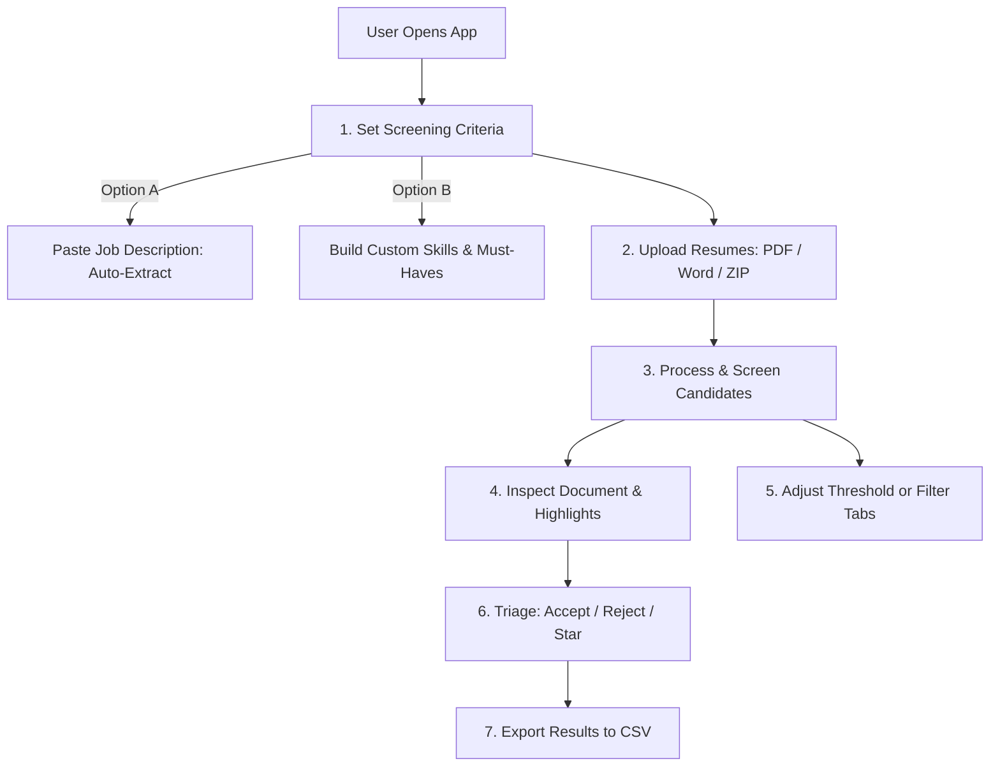

# 🤖 Assistant Bot Knowledge Base & User Guide: My CV Parser

> **Purpose**: This guide is designed for AI Assistant Bots and Support Agents to understand every user-facing feature of **My CV Parser**, so the bot can accurately, politely, and effectively guide recruiters, hiring managers, and HR users through the app.

---

## 📌 Quick Reference for the Bot

When guiding users, keep these high-level principles in mind:
1. **Privacy-First**: The app is 100% client-side. No CVs, documents, or candidate personal data are ever uploaded to any cloud server or third-party database.
2. **Fresh Starting State**: The app starts with a completely clean slate—no pre-filled skills. Users define their own criteria via Job Description (JD) paste, preset chips, or custom keywords.
3. **Automated Triage + Manual Control**: The system automatically scores and classifies candidates as **Shortlisted** or **Rejected**, but the recruiter always has full manual override control (Accept, Reject, Star).

---

## 🗺️ App Navigation & Main Workflows

---

## 1. Setting Up Screening Criteria (Setup Modal)

Users can open the Criteria Setup modal anytime by clicking the **"Criteria / Setup"** button in the header or pressing <kbd>c</kbd> on their keyboard.

### Tab 1: Job Description (JD) Extractor (Recommended Way)
* **What it does**: Allows users to paste any raw Job Description text. The parser automatically extracts key technical skills, tools, soft skills, and suggested disqualifiers.
* **How to guide the user**:
  1. Open the Criteria modal (<kbd>c</kbd>) and go to the **"Job Description"** tab.
  2. Paste the full job posting text into the text box.
  3. Click **"Analyze Job Description"**.
  4. The app displays matched skills categorized by importance (Requirements with high weight 8-10, Bonus/Nice-to-have with weight 5).
  5. The user can review the chips, uncheck any unwanted skills, and click **"Apply JD Criteria"** to populate their skill list.

### Tab 2: Required Skills (Custom & Presets)
* **What it does**: Manages the positive keyword checklist used to evaluate candidate CVs. Starts completely fresh.
* **How to guide the user**:
  - **Adding Custom Skills**: Type the skill name in the input box, select a Weight (1 to 10, default 7), pick a Category (Technical, Soft, Tools, Cloud, etc.), and click **"Add Skill"**.
  - **Marking Must-Haves (⭐)**: Click the **"+ Must-Have"** badge on any skill chip. If a skill is marked as Must-Have, any candidate missing that skill will be **automatically disqualified**, regardless of their overall score.
  - **Using Category Presets**: Users can click quick preset chips from categories like *Frontend, Backend, DevOps, Mobile, QA, Data & AI, Cloud, and Soft Skills*.
  - **Adjusting Weights**: Higher weight (8-10) gives the skill greater impact on the candidate's Match Score.
  - **Clearing Skills**: Click **"Clear All"** to reset the list back to empty.

### Tab 3: Disqualifiers & Dealbreakers
* **What it does**: Configures negative keywords and automatic screening dealbreakers.
* **How to guide the user**:
  - **Disqualifiers (Instant Rejection)**: Negative keywords (e.g. `student`, `intern`, `visa sponsorship`, `relocation required`). If detected in the CV, the candidate is instantly flagged as **Rejected**.
  - **Soft Penalties (-Points)**: Negative keywords configured with a point penalty (e.g. -5% or -10% per occurrence).
  - **Bangladeshi Only Dealbreaker**: A toggle switch (ON by default). When enabled, candidates with foreign locations, non-BD addresses, or international phone numbers without local ties are automatically disqualified.

---

## 2. Uploading & Processing Resumes

Users can upload files in **Tab 4 (Upload & Process)** of the setup modal, or directly via the main upload drop zone.

* **Supported Formats**:
  - **PDF Documents** (`.pdf`)
  - **Microsoft Word Documents** (`.docx`)
  - **ZIP Archives** (`.zip`) containing bulk PDF and Word files (subfolders are automatically extracted).
* **How to guide the user**:
  1. Drag and drop single files, multi-selected files, or an entire ZIP bundle into the drop zone.
  2. Click **"Process Resumes"**.
  3. A live progress bar shows parsing progress (e.g. *Processing file 12 of 50...*).
  4. Once finished, the candidates instantly appear in the screening dashboard.

---

## 3. Screening, Sorting & Filtering Candidates

### The Candidate Master List (Left Panel)
Every processed candidate displays a summary card showing:
- **Candidate Name & Original File Name**
- **Match Score %** (Color-coded: Green for high, Yellow for medium, Slate/Red for low)
- **Status Badge**: `Shortlisted` (Green), `Rejected` (Red), or `Overridden` (Purple)
- **Experience Level & Years** (e.g. *Mid-Level • 3.5 yrs*)
- **Location Tag** (e.g. *Dhaka, Bangladesh*)
- **Missing Must-Haves Indicator** (e.g. *Missing: Python, Docker*)

### Filter Tabs
Guide users to switch between list views:
- **All**: View every processed candidate.
- **Shortlisted**: Only candidates who met the passing threshold, passed all Must-Haves, and triggered zero dealbreakers.
- **Rejected**: Candidates who fell below the passing score, missed Must-Haves, or hit a disqualifier.
- **Starred (⭐)**: Hand-picked favorites marked by the recruiter.

### Passing Score Threshold Slider
- Located at the top of the candidate list (Default: **60%**).
- Users can slide this between **0% and 100%** to instantly adjust the cutoff bar without reprocessing files.

### Search & Sort Controls
- **Search Bar** (Shortcut: <kbd>/</kbd>): Live search by candidate name, skill keyword, email, or filename.
- **Sort Dropdown**: Sort by *Match Score (High to Low)*, *Score (Low to High)*, *Experience (Years)*, or *Name (A-Z)*.

---

## 4. Candidate Inspector & Document Viewer (Right Panel)

When a candidate is selected, the right-hand panel provides deep inspection details:

### 1. Visual Document Viewer (PDF & Text)
- **Highlighted Mode (Default)**: Automatically highlights matched positive skills in **Green** and negative disqualifiers in **Red** directly over the document text.
- **Original Mode**: Switches to clean, unhighlighted view (Shortcut: <kbd>h</kbd>).
- **Interactive Links**: All candidate email addresses, portfolio URLs, GitHub, and LinkedIn links are clickable.

### 2. Inspector Details Bar (Shortcut: <kbd>i</kbd>)
- **Contact Card**: Verified Email, Phone number with Bangladesh Telecom Operator tag (Grameenphone, Banglalink, Robi, Airtel, Teletalk), LinkedIn, and GitHub links.
- **Experience Timeline**: Estimated total years and inferred seniority level (Junior, Mid, Senior, Lead).
- **Location & Residency**: Bangladeshi district/division confidence check.
- **Skill Breakdown**: Matched skills with occurrence counts, weighted coverage percentage, and missing skills.
- **Must-Have Checklist**: Clear visual confirmation of whether mandatory requirements were met.

### 3. Manual Recruiter Actions
- **Accept / Shortlist Button** (Shortcut: <kbd>a</kbd>): Manually forces the candidate into Shortlisted status.
- **Reject Button** (Shortcut: <kbd>r</kbd>): Manually marks the candidate as Rejected.
- **Star / Favorite Button** (Shortcut: <kbd>s</kbd> or <kbd>f</kbd>): Adds candidate to the Starred tab.
- **Reset Override**: Reverts the candidate back to their automated algorithmic score status.

---

## 5. Exporting Results

Guide users to export their hiring decisions:
1. Click the **"Export CSV"** button in the top navigation bar.
2. The app generates a structured, Excel-compatible `.csv` spreadsheet containing:
   - Candidate Name & File Name
   - Overall Match Score % & Skill Coverage %
   - Experience Level & Estimated Years
   - Contact Details (Email, Phone, BD Mobile Operator)
   - Location & Country
   - Must-Haves Met (YES/NO) & Missing Must-Haves
   - Full Matched Skills & Missing Skills lists
   - Disqualifiers Triggered
   - Final Screening Status (Shortlisted / Rejected)

---

## 6. Keyboard Shortcuts Cheat-Sheet

| Key | Action | What to tell the user |
| :---: | :--- | :--- |
| <kbd>k</kbd> or <kbd>↓</kbd> | **Next Candidate** | "Press <kbd>k</kbd> or Down Arrow to navigate to the next candidate." |
| <kbd>j</kbd> or <kbd>↑</kbd> | **Previous Candidate** | "Press <kbd>j</kbd> or Up Arrow to move to the previous candidate." |
| <kbd>a</kbd> | **Accept / Shortlist** | "Press <kbd>a</kbd> to quickly shortlist the selected candidate." |
| <kbd>r</kbd> | **Reject Candidate** | "Press <kbd>r</kbd> to reject the selected candidate." |
| <kbd>s</kbd> or <kbd>f</kbd> | **Star / Favorite** | "Press <kbd>s</kbd> or <kbd>f</kbd> to bookmark this candidate." |
| <kbd>h</kbd> | **Toggle PDF Highlights** | "Press <kbd>h</kbd> to turn skill highlight overlays on/off." |
| <kbd>i</kbd> | **Toggle Inspector** | "Press <kbd>i</kbd> to expand or collapse the candidate info panel." |
| <kbd>c</kbd> | **Criteria / Setup** | "Press <kbd>c</kbd> to open the Job Description & Skills setup dialog." |
| <kbd>/</kbd> | **Focus Search** | "Press <kbd>/</kbd> to instantly search candidates by name or skill." |
| <kbd>?</kbd> | **Help / Shortcuts** | "Press <kbd>?</kbd> to see all available keyboard hotkeys." |
| <kbd>Esc</kbd> | **Close / Dismiss** | "Press <kbd>Esc</kbd> to close any open modal dialog." |

---

## 7. Chatbot Response Playbook (Common User Inquiries)

### Q1: *"Why was a candidate rejected even though they have a high score like 85%?"*
> **Bot Answer**:
> "A candidate can receive a high score but still be marked **Rejected** if they trigger a **Dealbreaker**:
> 1. **Missing a Must-Have Skill (⭐)**: If any required skill is marked with a star (Must-Have) and is not present in their CV, they are automatically disqualified.
> 2. **Disqualifier Keyword**: Their CV contained a word configured in your Disqualifiers list (e.g. 'student', 'intern', 'visa required').
> 3. **Location Dealbreaker**: If 'Bangladeshi Only' is turned on and the candidate is detected to be outside Bangladesh.
> 
> *Tip*: You can see the exact reason under the candidate's name or in the right-hand Inspector panel. You can also press <kbd>a</kbd> to manually accept them if you want to override the decision!"

---

### Q2: *"How do I start with a clean skill list?"*
> **Bot Answer**:
> "The app starts completely fresh with no pre-filled skills! To set up your skills:
> 1. Press <kbd>c</kbd> (or click **Criteria / Setup**).
> 2. Go to the **Job Description** tab to paste a JD and auto-extract skills, OR go to the **Required Skills** tab to add skills manually or pick from our preset chips.
> 3. If you ever want to clear existing skills, just click the red **'Clear All'** button on the Required Skills tab."

---

### Q3: *"Can I upload a ZIP file of 100 resumes at once?"*
> **Bot Answer**:
> "Yes! You can drag and drop a single `.zip` file containing all your candidate resumes. The app will automatically unzip and process all `.pdf` and `.docx` files inside. Subfolders are handled automatically too!"

---

### Q4: *"Are candidate resumes uploaded to any server or cloud?"*
> **Bot Answer**:
> "No, your candidate data is 100% private and secure. All resume parsing, text analysis, and scoring happens locally inside your web browser. Nothing is ever sent to external servers or cloud databases."

---

### Q5: *"Why does a PDF say 'No selectable text found (Scanned PDF)' or have a 0% score?"*
> **Bot Answer**:
> "This happens when a resume is a scanned image or photograph saved as a PDF rather than a digital text PDF. Because it contains image pixels rather than selectable text characters, the parser cannot read words. You can review the visual document in the viewer and assign a manual status with <kbd>a</kbd> (Accept) or <kbd>r</kbd> (Reject)."

---

### Q6: *"How is the Match Score calculated?"*
> **Bot Answer**:
> "The Match Score combines two key factors:
> 1. **Skill Breadth Coverage (70%)**: The proportion of your required skills present in the candidate's CV, weighted by each skill's importance (1–10).
> 2. **Skill Depth & Frequency (30%)**: How frequently and prominently those skills appear throughout the candidate's work history and projects.
> 
> Any soft penalties from negative keywords are subtracted from this total."

---

### Q7: *"Can I change the passing score without re-uploading all files?"*
> **Bot Answer**:
> "Yes! Just drag the **Passing Threshold Slider** at the top of the candidate list. Moving it immediately recalculates who is Shortlisted vs Rejected without reprocessing your files."
